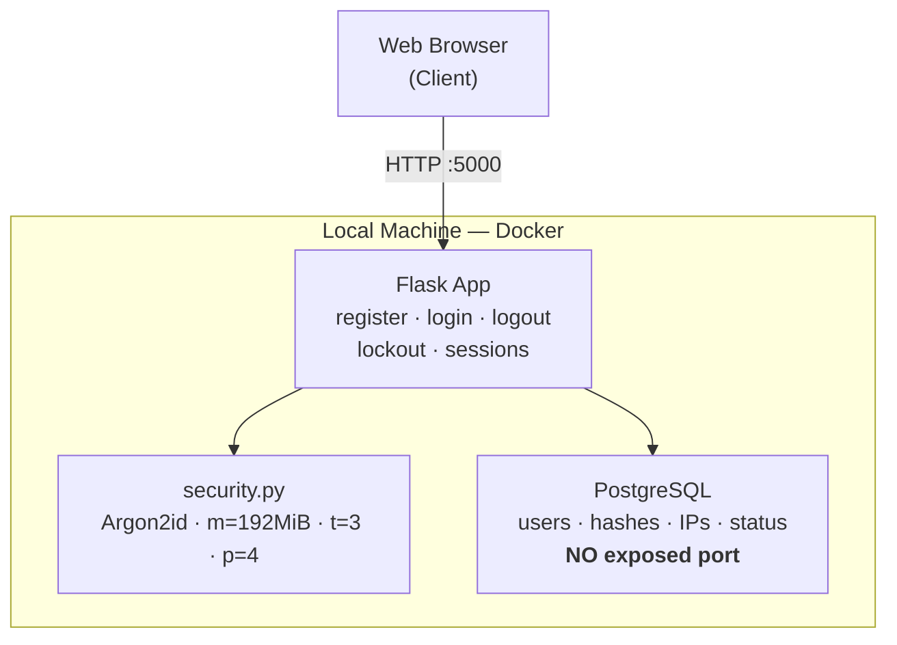

# gcloud — Hybrid Authentication System

A self-hosted authentication system where **credentials never leave hardware under the operator's control**. The application layer serves users; all user data stays on an isolated database that is never exposed to the internet directly.

Built from first principles — no scaffolding, no generated boilerplate. The goal was not merely a working login flow, but to make every security-relevant decision deliberately and to justify each one against the specific threat it addresses.

---

## Architecture



The database publishes **no port to the host**. It is reachable only from the application container over an internal Docker network.

---

## Design philosophy

**Every security layer maps to a specific, named threat.** Layers are not treated as inherently protective — an unjustified control adds complexity and enlarges the attack surface without buying corresponding safety. Where a control appears below, a concrete threat justified it. Where a plausible control is absent, that absence was a decision, not an oversight.

---

## Threat model

| Threat | Attack | Control |
|---|---|---|
| Credential theft | Database is exfiltrated | Argon2id one-way hashing; plaintext never stored |
| Offline cracking | Stolen hashes brute-forced on GPUs | Memory-hard parameters tuned to ~201 ms/hash |
| Online brute force | Repeated guesses against one account | Account lockout: 5 attempts → 15-minute lock |
| User enumeration | Probing to map valid accounts | Identical generic responses in all cases |
| Hashing DoS | Oversized password forces costly hashing | Length cap enforced before Argon2id runs |
| Direct DB access | Reaching PostgreSQL over the network | No published port; internal Docker network only |
| Session forgery | Editing a cookie to escalate | Server-side signed sessions (`SECRET_KEY`) |
| IP-ban evasion | Spoofing `X-Forwarded-For` | Proxy headers trusted only under explicit config |
| Audit-trail loss | Deleting a user erases history | Soft delete: status change, row retained |

---

## Security decisions

### Hashing, not encryption
Passwords are hashed, never encrypted. Hashing is one-way; encryption is reversible and fails the moment its key is compromised — and that key usually lives on the same server as the data. A stolen store of hashes is useless without an expensive per-password guessing attack.

### Argon2id
Argon2id is the OWASP first choice. It is *memory-hard*: each hash allocates a large block of RAM, which neutralises GPU cracking (many cores, little memory each).

| Algorithm | Cost | Decision |
|---|---|---|
| **Argon2id** | Memory-hard | **Selected** — strongest GPU resistance |
| scrypt | Memory-hard | Viable; Argon2id newer and OWASP-preferred |
| bcrypt | CPU only | Rejected — not memory-hard; truncates past 72 bytes |
| PBKDF2 | Minimal memory | Rejected — trivially parallelised on GPU/ASIC |

### Benchmarked parameters
Parameters were **measured on the target hardware** (Intel i5-8350U), not copied from defaults:

| memory_cost | t | p | Time/hash | Note |
|---|---|---|---|---|
| 19,456 (19 MiB) | 2 | 1 | ~31 ms | OWASP floor — too fast |
| 65,536 (64 MiB) | 3 | 4 | ~58 ms | Below target |
| 131,072 (128 MiB) | 3 | 4 | ~126 ms | Approaching target |
| **196,608 (192 MiB)** | **3** | **4** | **~201 ms** | **Selected** |
| 262,144 (256 MiB) | 3 | 4 | ~235 ms | Higher memory pressure |

Worst-case memory is `memory_cost × concurrent hashes`. At 192 MiB, ten concurrent logins demand ~1.9 GB — within the host's headroom. The 256 MiB option was rejected on this calculation (2.5 GB), not on latency. Selected: **`m=196608, t=3, p=4` → ~201 ms/hash, 10× the OWASP floor.**

### Least exposure
PostgreSQL exposes a port only on the internal Docker network; it is never mapped to the host (`0.0.0.0`). Development access, when needed, is bound strictly to loopback (`127.0.0.1`) — a deliberately narrow exception, never an open door.

### Username enumeration defence
Login returns `"Incorrect username or password"` whether the account exists or not. Registration reports a name as `"not available"`, not `"taken"`. An attacker probing for accounts learns nothing.

### Ordering as a control
Argon2id is deliberately expensive, so **cheap rejections run before it, everywhere.** Input validation and availability checks (registration), and deleted/banned/locked checks (login), all precede the hash. Reversing the order would make each endpoint a DoS amplifier — the 128-char password cap exists for the same reason.

### Soft delete
Removal sets `status = 'deleted'` rather than deleting the row — preserving the audit trail, maintaining referential integrity, and staying reversible. A removed account is blocked at login and can never authenticate again.

### Account lockout
Five consecutive failures lock an account for 15 minutes. The lock is stored as an **expiry timestamp**, so time releases it with no background job. It is checked *before* password verification — a correct password is still rejected under an active lock.

### IP trust boundary
Proxy headers (`X-Forwarded-For` / `CF-Connecting-IP`) are honoured **only when the deployment is explicitly configured** to sit behind a trusted proxy; otherwise the raw socket address is used. Trust is placed in the deployment topology, not in an attacker-controllable header.

### Session integrity
Sessions are signed with `SECRET_KEY`. The client can read the cookie but cannot alter it without breaking the signature — this is what prevents a user editing their own session to escalate privileges. Secrets are read from the environment and fail loudly if missing.

---

## Data model — `users`

| Column | Type | Notes |
|---|---|---|
| `id` | Integer, PK | Auto-increment; immutable identifier |
| `username` | String(64) | Unique, indexed, NOT NULL |
| `password_hash` | String(255) | Argon2id output, NOT NULL; never plaintext |
| `role` | String(16) | NOT NULL, default `user` |
| `status` | String(16) | NOT NULL, default `active`, indexed |
| `registration_ip` | String(45) | Nullable; sized for IPv6 |
| `last_login_ip` | String(45) | Nullable; NULL until first login |
| `failed_attempts` | Integer | NOT NULL, default 0 |
| `locked_until` | DateTime(tz) | Nullable; NULL = not locked |
| `created_at` | DateTime(tz) | UTC-aware creation timestamp |

`unique` is a business rule (only `username` needs it); `NOT NULL` is a guarantee applied only where absence would be invalid. NULL is a meaningful state — e.g. `locked_until = NULL` means "not locked".

---

## Tech stack

- **Python / Flask** — application and routing
- **Flask-SQLAlchemy** — ORM over PostgreSQL
- **PostgreSQL** (Docker) — user store, network-isolated
- **argon2-cffi** — Argon2id hashing
- **Docker Compose** — orchestration and isolation

---

## Running locally

Configuration is supplied through environment variables, kept out of version control:

```env
POSTGRES_USER=...
POSTGRES_PASSWORD=...
POSTGRES_DB=...
DATABASE_URL=postgresql+psycopg://USER:PASS@db:5432/DB
SECRET_KEY=<64-char hex>   # signs session cookies
```

```bash
docker compose up -d      # start PostgreSQL (isolated)
python create_tables.py   # one-time schema provisioning
python app.py             # serve the application → http://127.0.0.1:5000
```

---

*Every control here answers a specific threat listed above. No layer was added without a threat to justify it — unjustified layers are not protection, only more surface to defend.*
